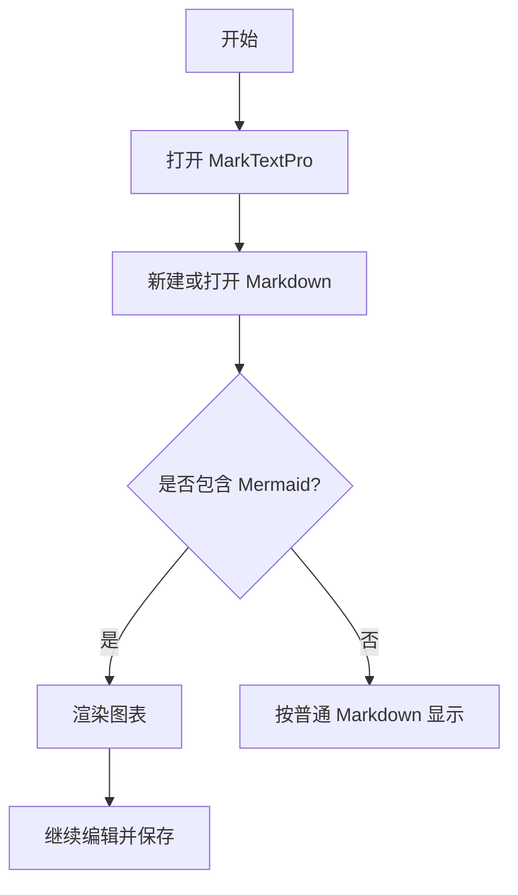
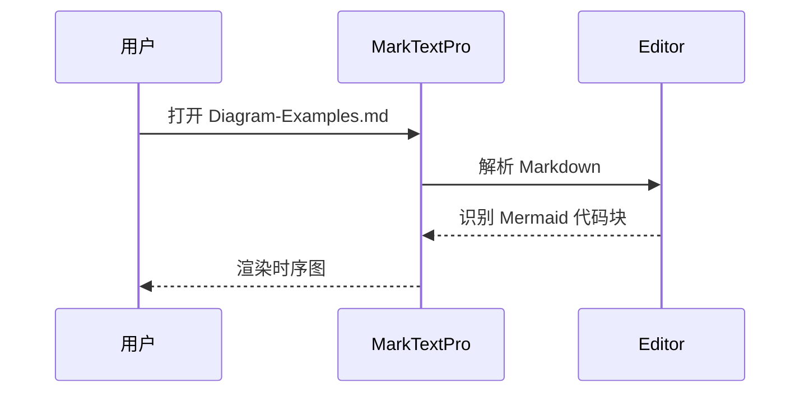
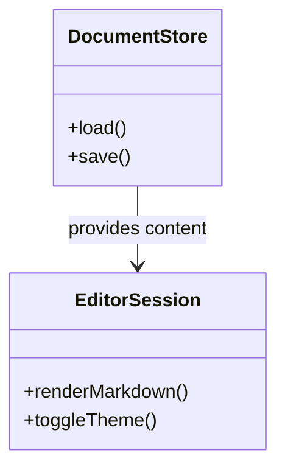
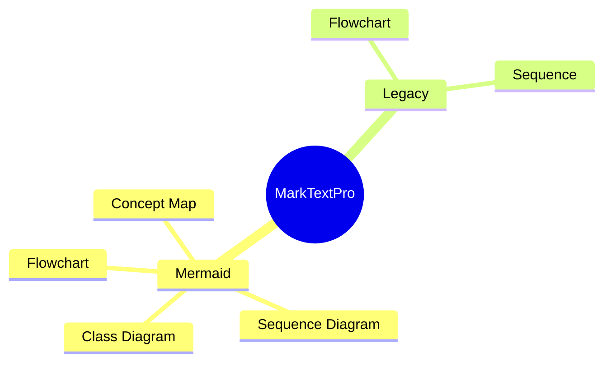

# Diagram Examples

这是一份用于 `MarkTextPro` 图表能力测试的示例文档。

## 1. Mermaid Flowchart



## 2. Mermaid Sequence Diagram



## 3. Mermaid Class Diagram



## 4. Legacy Flowchart

下面这个不是 Mermaid，而是老的 `flowchart.js` 语法：

```flowchart
st=>start: Start
op=>operation: Edit Markdown
cond=>condition: Save file?
e=>end: End

st->op->cond
cond(yes)->e
cond(no)->op
```

## 5. Legacy Sequence

下面这个也不是 Mermaid，而是老的 `js-sequence-diagrams` 语法：

```sequence
用户->MarkTextPro: 打开文档
MarkTextPro->Editor: 加载内容
Editor-->MarkTextPro: 返回渲染结果
MarkTextPro-->用户: 展示图表
```

## 6. Mermaid Mindmap


