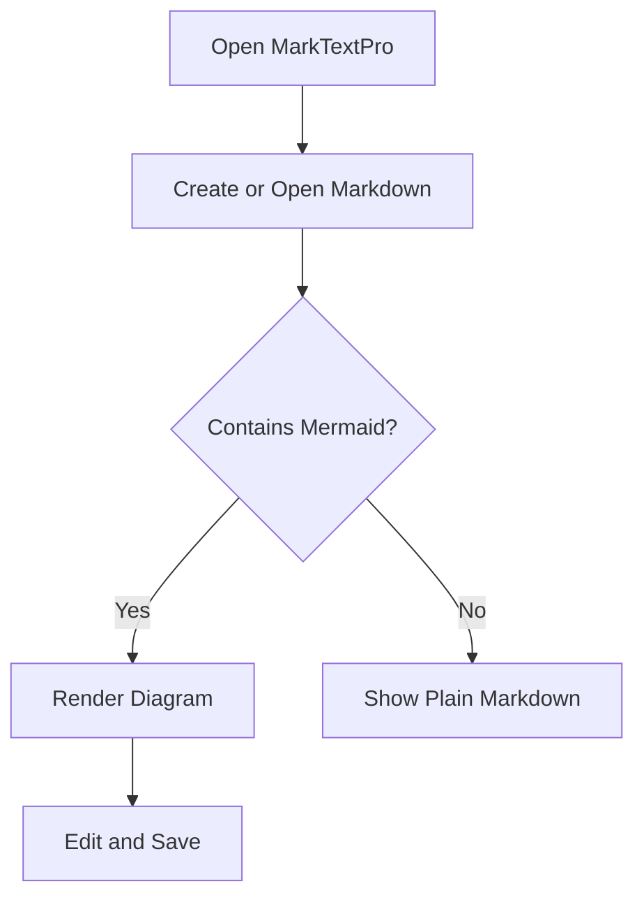
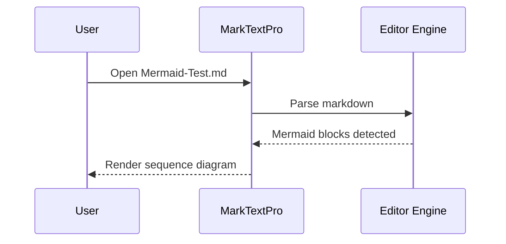
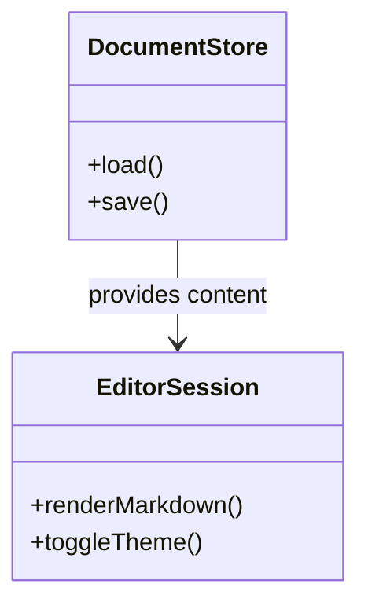

# Mermaid Test

这是一份用于测试 `MarkTextPro` Mermaid 渲染能力的文档。

## Flowchart

```mermaid
flowchart TD
    A[Open MarkTextPro] --> B[Create or Open Markdown]
    B --> C{Contains Mermaid?}
    C -->|Yes| D[Render Diagram]
    C -->|No| E[Show Plain Markdown]
    D --> F[Edit and Save]
```

## Sequence Diagram

```mermaid
sequenceDiagram
    participant U as User
    participant M as MarkTextPro
    participant E as Editor Engine

    U->>M: Open Mermaid-Test.md
    M->>E: Parse markdown
    E-->>M: Mermaid blocks detected
    M-->>U: Render sequence diagram
```

## Class Diagram

```mermaid
classDiagram
    class DocumentStore {
        +load()
        +save()
    }

    class EditorSession {
        +renderMarkdown()
        +toggleTheme()
    }

    DocumentStore --> EditorSession : provides content
```

