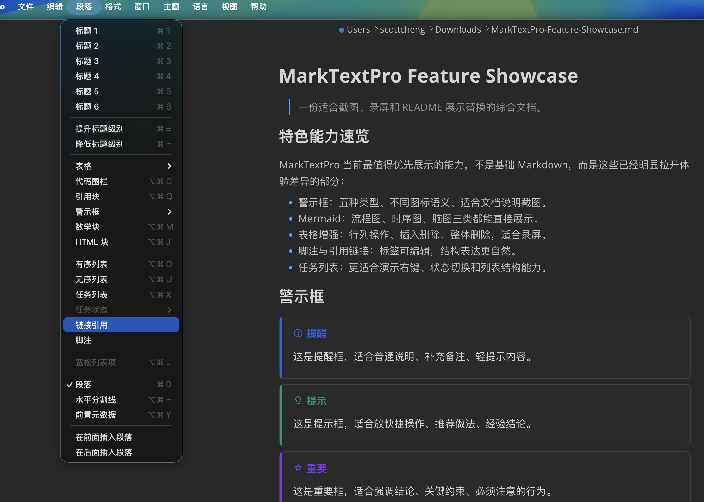
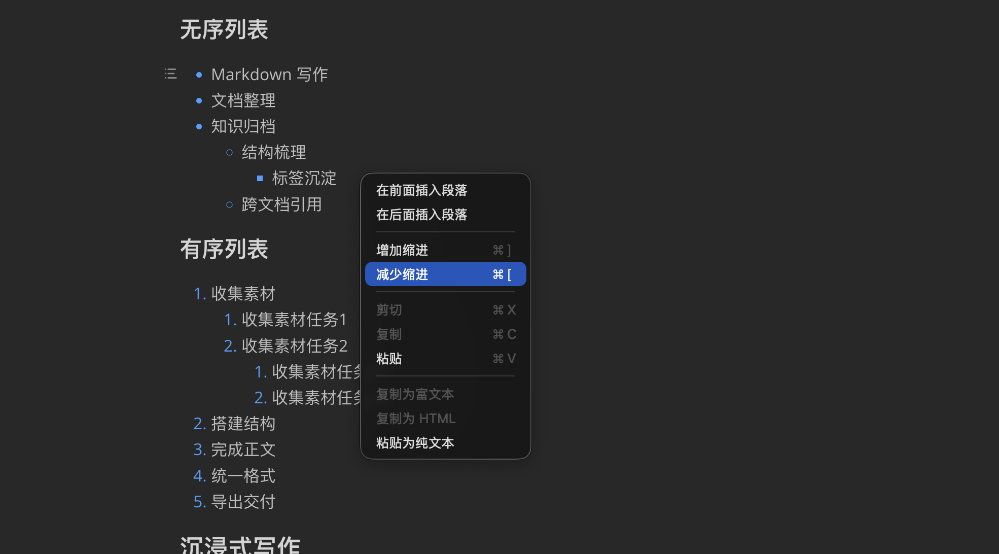
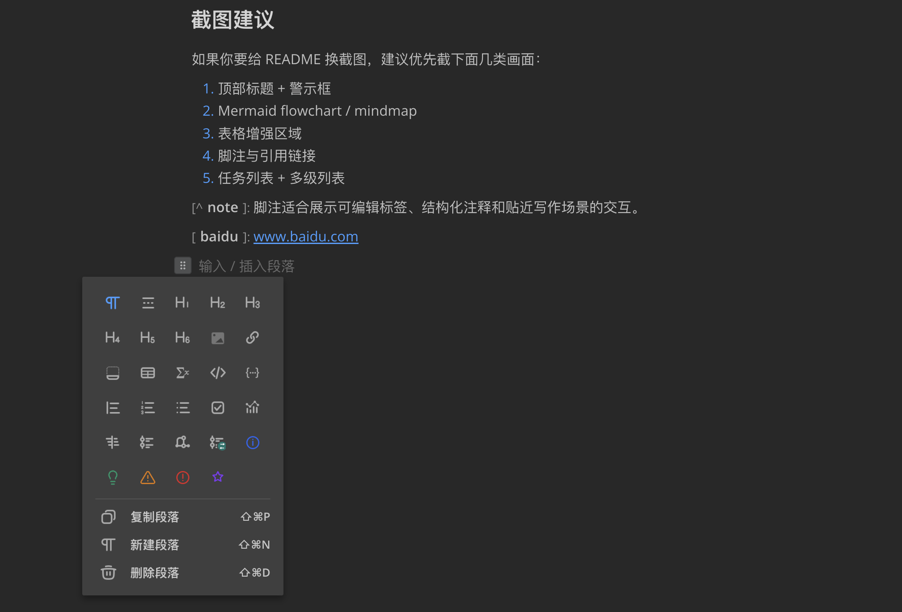
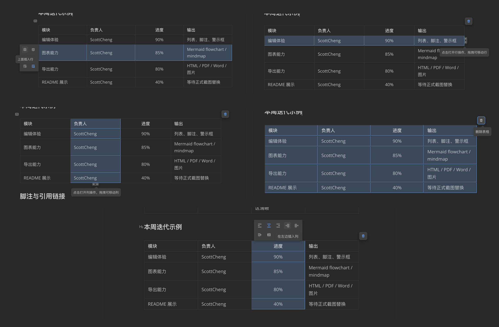

<h1 align="center">MarkTextPro</h1>

  <strong>:high_brightness: Next generation markdown editor :crescent_moon:</strong> 
  A simple and elegant open-source markdown editor that focused on speed and usability. 
  Available for Linux, macOS and Windows.

 

  <!-- License -->
  
  <!-- Downloads total -->
  
  <!-- Downloads latest release -->
  

  <h3>
    <a href="https://github.com/scott20201225/marktext-pro">
      Repository
    </a>
     | 
    <a href="https://github.com/scott20201225/marktext-pro#features">
      Features
    </a>
     | 
    <a href="https://github.com/scott20201225/marktext-pro#download-and-installation">
      Downloads
    </a>
     | 
    <a href="https://github.com/scott20201225/marktext-pro#development">
      Development
    </a>
     | 
    <a href="https://github.com/scott20201225/marktext-pro#contribution">
      Contribution
    </a>
  </h3>

  Translations:
  <a href="docs/i18n/README-zh_cn.md#readme">
    :cn:
  </a>
  <a href="docs/i18n/README-zh_tw.md#readme">
    :taiwan:
  </a>
  <a href="docs/i18n/README-jp.md#readme">
    :jp:
  </a>
  <a href="docs/i18n/README-fr.md#readme">
    :fr:
  </a>
  <a href="docs/i18n/README-tr.md#readme">
    :tr:
  </a>
  <a href="docs/i18n/README-es.md#readme">
    :es:
  </a>
  <a href="docs/i18n/README-pt.md#readme">
    :portugal:
  </a>
  <a href="docs/i18n/README-kr.md#readme">
    :kr:
  </a>
  <a href="docs/i18n/README-bn.md#readme">
    :bangladesh:
  </a>

  
    Based on MarkText and further developed as MarkTextPro. See the
    <a href="LICENSE">license</a>
    and repository history for attribution details.
  

 

## Screenshot

The logo is retired from the screenshot area. Below are real product shots taken from the current MarkTextPro build.

[Open the full feature showcase image](docs/assets/screenshots/showcase-overview.png)

<table>
  <tr>
    <td align="center">
      
       
      Five warning callout styles
    </td>
    <td align="center">
      
       
      Paragraph menu and warning callouts
    </td>
  </tr>
  <tr>
    <td align="center">
      
       
      Bulk task status editing
    </td>
    <td align="center">
      
       
      List indent and outdent context menu
    </td>
  </tr>
  <tr>
    <td align="center" colspan="2">
      
       
      Inline insert palette
    </td>
  </tr>
  <tr>
    <td align="center" colspan="2">
      
       
      Table editing toolkit overview
    </td>
  </tr>
</table>

## Features

- Realtime preview (WYSIWYG) and a clean and simple interface to get a distraction-free writing experience.
- Support [CommonMark Spec](https://spec.commonmark.org), [GitHub Flavored Markdown Spec](https://github.github.com/gfm/) and selective support [Pandoc markdown](https://pandoc.org/MANUAL.html#pandocs-markdown).
- Markdown extensions such as math expressions (KaTeX), front matter and emojis.
- Support paragraphs and inline style shortcuts to improve your writing efficiency.
- Output **HTML** and **PDF** files.
- Various [themes](https://github.com/scott20201225/marktext-pro/tree/main/docs): **Cadmium Light**, **Material Dark** etc.
- Various editing modes: **Source Code mode**, **Typewriter mode**, **Focus mode**.
- Paste images directly from clipboard.

## Download and Installation

|                                                                                          |                                                                                          |                                                                                                        |
|:-------------------------------------------------------------------------------------------------------------------------------------------------------------------------------------------:|:-----------------------------------------------------------------------------------------------------------------------------------------------------------------------------------------------:|:-----------------------------------------------------------------------------------------------------------------------------------------------------------------------------------------------------------:|
|  |  |  |

Want to see new features of the latest version? Please refer to [CHANGELOG](https://github.com/scott20201225/marktext-pro/tree/main/docs).

#### macOS

Requires macOS 11 (Big Sur) or later. Universal builds aren't published — pick the matching `arm64` or `x64` installer.

You can download the latest `marktextpro-mac-(arm64|x64)-%version%.dmg` from the [release page](https://github.com/scott20201225/marktext-pro/releases/latest).

#### Windows

Requires Windows 10 or 11. Both x64 and arm64 installers are published — pick the architecture that matches your machine.

Simply download and install MarkTextPro via the setup wizard (`marktextpro-win-(x64|arm64)-%version%-setup.exe`) and choose whether to install per-user or machine wide.

#### Linux

Please follow the [Linux installation instructions](https://github.com/scott20201225/marktext-pro/tree/main/docs).

#### Other

All binaries for Linux, macOS and Windows can be downloaded from the [release page](https://github.com/scott20201225/marktext-pro/releases/latest). If a version is unavailable for your system, then please open an [issue](https://github.com/scott20201225/marktext-pro/issues).

## Development

If you wish to build MarkTextPro yourself, please check out our [build instructions](https://github.com/scott20201225/marktext-pro/tree/main/docs).

- [User documentation](https://github.com/scott20201225/marktext-pro/tree/main/docs)
- [Developer documentation](https://github.com/scott20201225/marktext-pro/tree/main/docs)

If you have any questions regarding MarkTextPro, you are welcome to write an issue. When doing so please use the default format found when opening an issue. Of course, if you submit a PR directly, it will be greatly appreciated.

## Contribution

MarkTextPro is in development, please make sure to read the [Contributing Guide](.github/CONTRIBUTING.md) before making a pull request. Want to add some features to MarkTextPro? Please open an issue first and describe the use case.

## Contributors

Thank you to all the people who have already contributed to MarkTextPro [[contributors](https://github.com/scott20201225/marktext-pro/graphs/contributors)].

## License

[**MIT**](LICENSE).
