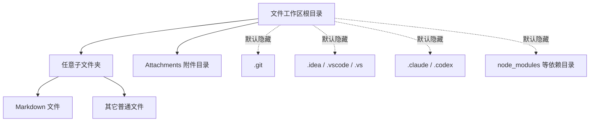
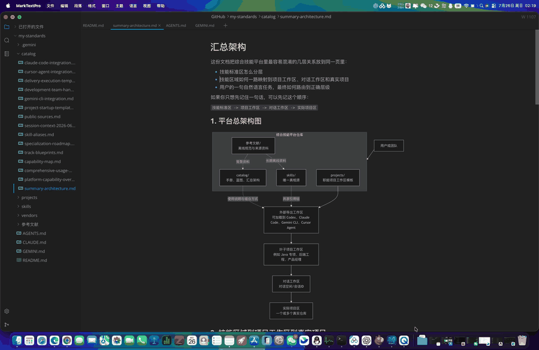
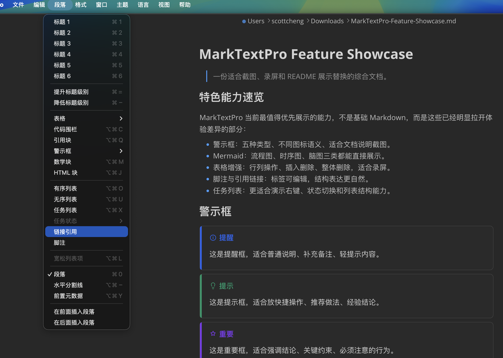
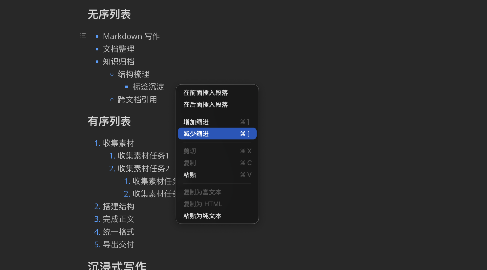
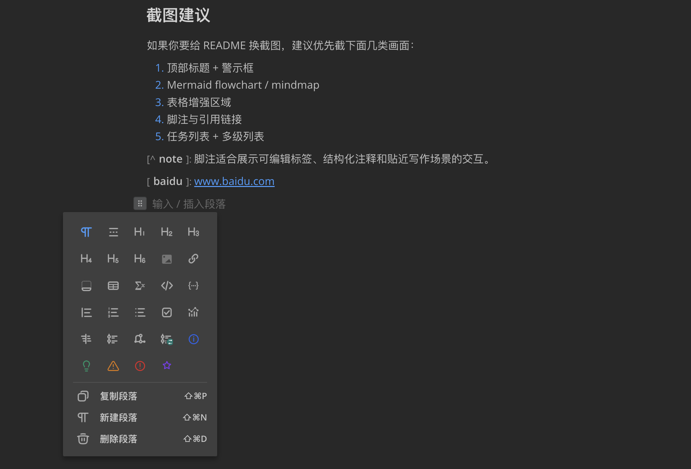
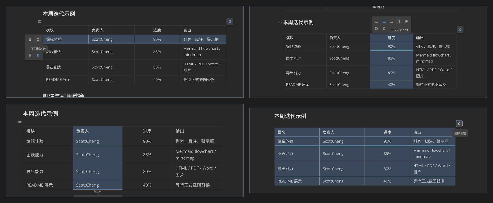
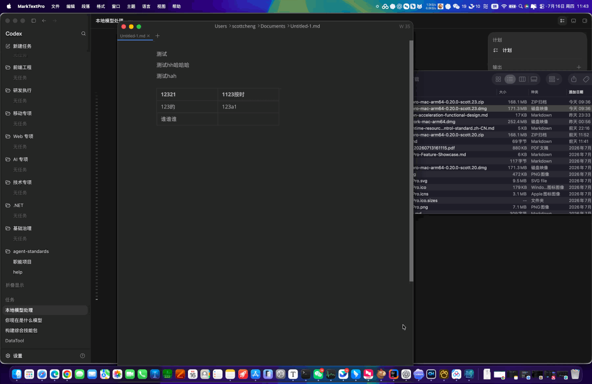
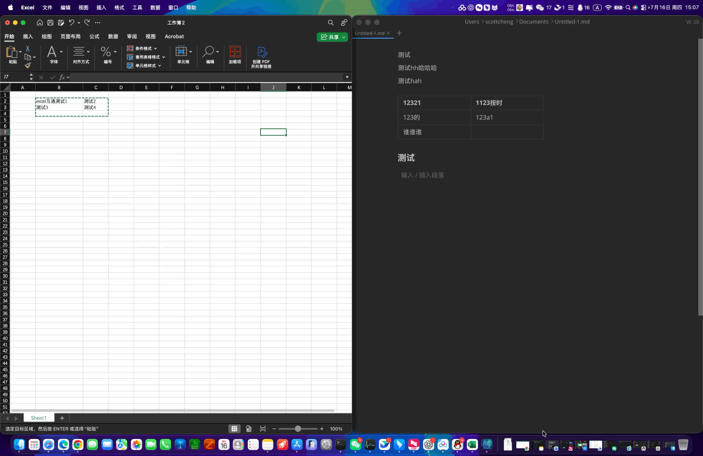

<p align="center"></p>

<h1 align="center">MarkTextPro</h1>

<div align="center">
  <strong>集成 Git 的 Markdown 文件编辑管理器</strong><br>
  面向本地文件夹、外部 Markdown 文件和 Git 仓库的轻量编辑管理工具。<br>
  <sub>支持 Linux、macOS、Windows。</sub>
</div>

<br>

<div align="center">
  <a href="LICENSE">
    
  </a>
  <a href="https://github.com/scott20201225/marktext-pro/releases">
    
  </a>
  <a href="https://github.com/scott20201225/marktext-pro/releases/latest">
    
  </a>
</div>

<div align="center">
  <h3>
    <a href="#产品定位">产品定位</a>
    <span> | </span>
    <a href="#核心能力">核心能力</a>
    <span> | </span>
    <a href="#产品选择">产品选择</a>
    <span> | </span>
    <a href="#文件工作区模型">工作区模型</a>
    <span> | </span>
    <a href="#git-联动">Git 联动</a>
    <span> | </span>
    <a href="#截图与演示">截图与演示</a>
    <span> | </span>
    <a href="#下载安装">下载安装</a>
  </h3>
</div>

## 产品定位

MarkTextPro 是一款集成 Git 的 Markdown 文件编辑管理器。它保留自由文件夹管理方式，适合编辑外部 Markdown、维护项目文档、整理本地资料，也适合把一个普通文件夹直接变成可以提交、同步、回滚的 Git 工作区。

## 产品选择

MarkTextPro 和 MarkNotePro 是两个相互独立、但能力互补的产品。

- MarkTextPro：集成 Git 的 Markdown 文件编辑管理器，强调自由文件夹、外部 Markdown 文件、项目文档和临时编辑。
- MarkNotePro：集成 Git 的本地 Markdown 笔记工具，强调笔记工作区、分区组、分区、笔记和长期知识管理。

相关地址：

- MarkTextPro GitHub：[https://github.com/scott20201225/marktext-pro](https://github.com/scott20201225/marktext-pro)
- MarkTextPro Releases：[https://github.com/scott20201225/marktext-pro/releases/latest](https://github.com/scott20201225/marktext-pro/releases/latest)
- MarkNotePro GitHub：[https://github.com/scott20201225/marknote-pro](https://github.com/scott20201225/marknote-pro)
- MarkNotePro Releases：[https://github.com/scott20201225/marknote-pro/releases/latest](https://github.com/scott20201225/marknote-pro/releases/latest)

选择建议：

| 使用场景 | 推荐产品 |
| --- | --- |
| 你要自由打开任意文件夹或外部 Markdown 文件 | MarkTextPro |
| 你经常编辑项目 README、技术文档、临时 Markdown 文件 | MarkTextPro |
| 你不想被笔记体系限制，只需要一个带 Git 的 Markdown 文件管理器 | MarkTextPro |
| 你要长期维护个人笔记、知识库、项目资料，并希望结构稳定 | MarkNotePro |
| 你希望笔记目录通过 Git 同步到远程仓库，多台电脑保持一致 | MarkNotePro |
| 你希望使用分区组、分区、笔记这种清晰的笔记层级 | MarkNotePro |

## 核心能力

- **本地文件夹管理**：直接打开文件夹，按真实目录结构管理 Markdown 文件。
- **外部 Markdown 编辑**：可以打开工作区外的 Markdown 文件，适合临时编辑和文档处理。
- **多标签编辑**：支持多个 Markdown 文件同时打开、切换和编辑。
- **Markdown 所见即所得编辑**：支持标题、列表、任务、表格、引用、代码块、数学公式、Mermaid 等常用 Markdown 能力。
- **表格增强**：支持表格批量编辑、复制粘贴、与 Excel 互操作等高频办公能力。
- **工作区附件处理**：当文件位于工作区内时，本地图片可复制到工作区附件目录并使用相对路径；工作区外文件则保持外部路径逻辑。
- **隐藏开发噪音目录**：工作区树默认隐藏 `.git`、`.idea`、`.vscode`、`.vs`、`.claude`、`.codex`、`node_modules` 等常见工具目录。
- **集成 Git 工作区**：内置 Git 操作界面，支持仓库添加、克隆、变更查看、提交、分支、拉取、推送等操作。
- **文件工作区与 Git 仓库联动**：可以从 Git 仓库切换文件工作区，也可以在工作区根目录重命名后同步更新 Git 仓库路径。

## 文件工作区模型

MarkTextPro 的工作区就是一个真实文件夹。它不会强制分区组、分区、笔记层级，而是尊重本地目录结构；同时会过滤掉对 Markdown 编辑管理意义不大的工具目录，保持侧边栏清爽。


```mermaid
flowchart TD
  Root["文件工作区根目录"] --> Folder["任意子文件夹"]
  Folder --> Markdown["Markdown 文件"]
  Folder --> Other["其它普通文件"]
  Root --> Attach["Attachments 附件目录"]
  Root -. "默认隐藏" .-> Git[".git"]
  Root -. "默认隐藏" .-> IDE[".idea / .vscode / .vs"]
  Root -. "默认隐藏" .-> Agent[".claude / .codex"]
  Root -. "默认隐藏" .-> Deps["node_modules 等依赖目录"]
```

工作区规则：

- 文件夹名称和文件名称按真实文件系统显示。
- 只打开 Markdown 文件进行编辑，其它文件主要作为目录内容存在。
- 剪切、粘贴、重命名、删除文件或文件夹时，会同步处理已打开标签的路径指向。
- 删除工作区内文件时，相关编辑标签会同步关闭，避免继续编辑已不存在的文件。
- 根目录重命名后，会同步更新受管 Git 仓库路径。

## Git 联动

MarkTextPro 把 Git 作为文件工作区的版本管理能力。你可以在编辑区处理 Markdown 文件，也可以切换到 Git 区完成提交、拉取、推送和历史查看。


```mermaid
flowchart LR
  Editor["编辑区"] -- "点击 Git 按钮" --> Git["Git 区"]
  Git -- "点击编辑按钮" --> Editor
  Git -- "选择仓库" --> Confirm{"确认切换仓库？"}
  Confirm -- "确认，并勾选切换工作区" --> Workspace["将文件工作区切换到当前仓库或子目录"]
  Confirm -- "确认，但不切换工作区" --> GitOnly["仅切换 Git 仓库"]
  Workspace --> Reload["关闭已打开文件并重载工作区"]
  Editor -- "重命名根目录" --> Sync["同步更新受管 Git 仓库路径"]
  Sync --> Git
```

联动关系：

- Git 区可以选择仓库，切换前会确认，避免误点。
- 默认可以勾选“切换工作区”，让文件工作区跟随当前 Git 仓库。
- 也可以取消勾选，只切换 Git 仓库，保留当前文件工作区。
- 从 Git 区可以把当前仓库根目录或仓库子目录设置为文件工作区。
- 如果工作区根目录重命名，MarkTextPro 会同步更新受管 Git 仓库路径，避免 Git 区找不到仓库。
- 允许 Git 仓库和文件工作区不是同一个目录，适合更复杂的本地目录规划。

## 截图与演示

[查看完整功能展示图](docs/assets/screenshots/showcase-overview.png)

<table>
  <tr>
    <td align="center" colspan="2">
      
      <br>
      <sub>在编辑区和 Git 区之间切换，完成仓库操作与工作区联动</sub>
    </td>
  </tr>
  <tr>
    <td align="center">
      
      <br>
      <sub>五种警告块样式</sub>
    </td>
    <td align="center">
      
      <br>
      <sub>段落菜单与警告块</sub>
    </td>
  </tr>
  <tr>
    <td align="center">
      
      <br>
      <sub>任务状态批量编辑</sub>
    </td>
    <td align="center">
      
      <br>
      <sub>列表缩进菜单</sub>
    </td>
  </tr>
  <tr>
    <td align="center" colspan="2">
      
      <br>
      <sub>插入面板</sub>
    </td>
  </tr>
  <tr>
    <td align="center" colspan="2">
      
      <br>
      <sub>表格工具能力</sub>
    </td>
  </tr>
  <tr>
    <td align="center">
      
      <br>
      <sub>表格复制粘贴</sub>
    </td>
    <td align="center">
      
      <br>
      <sub>Excel 与 MarkTextPro 表格互操作</sub>
    </td>
  </tr>
  <tr>
    <td align="center" colspan="2">
      
      <br>
      <sub>集成 Git 工作区：查看变更、历史、分支并提交同步</sub>
    </td>
  </tr>
</table>

## 下载安装


请从 [Release 页面](https://github.com/scott20201225/marktext-pro/releases/latest) 下载对应系统版本：

- macOS：`marktextpro-mac-(arm64|x64)-%version%.dmg`
- Windows：`marktextpro-win-(x64|arm64)-%version%-setup.exe`
- Linux：提供 `deb`、`rpm`、`snap`、`tar.gz` 等构建，具体以 Release 页面为准。

## 开发

```bash
pnpm install
pnpm --filter marktextpro dev
```

构建桌面端：

```bash
pnpm --filter marktextpro build
```

## 许可

[MIT](LICENSE)
