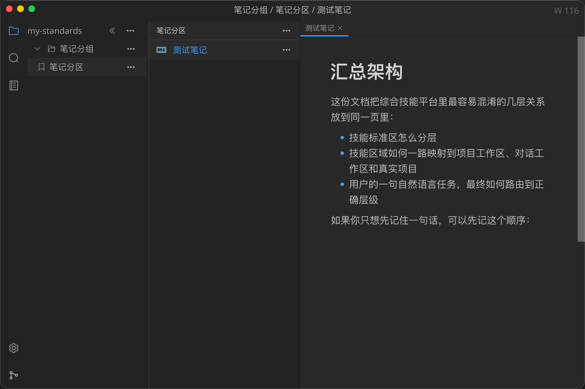
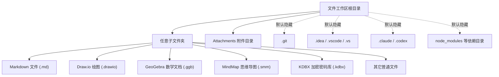
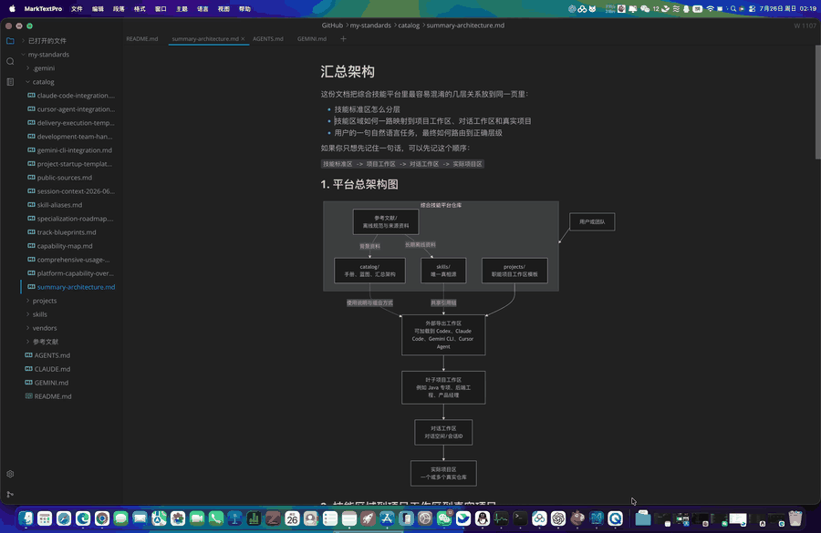
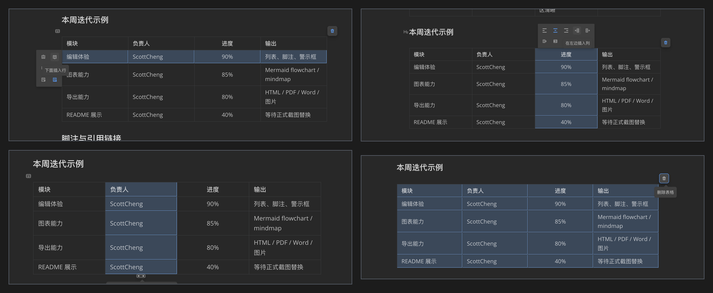
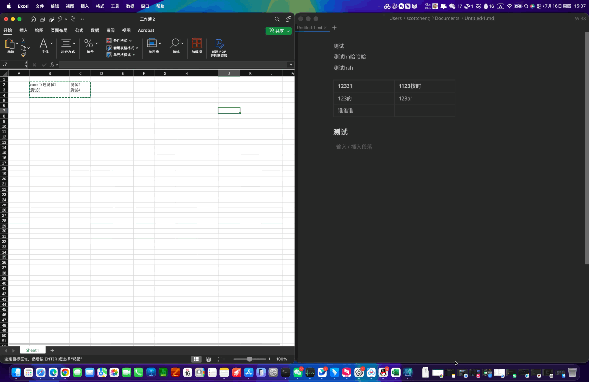

<p align="center"></p>

<h1 align="center">MarkTextPro</h1>

<div align="center">
  <strong>集成 Git 的多模态 Markdown 文件编辑管理器</strong><br>
  面向本地文件夹、外部文件、代码项目与 Git 仓库的轻量自由编辑管理工具。<br>
  <sub>支持 Linux、macOS、Windows。</sub>
</div>

<br>

<div align="center">
  <a href="LICENSE">
    
  </a>
  <a href="https://github.com/scott20201225/marktext-pro/releases">
    
  </a>
  <a href="https://github.com/scott20201225/marktext-pro/releases/latest">
    
  </a>
</div>

<div align="center">
  <h3>
    <a href="#产品定位">产品定位</a>
    <span> | </span>
    <a href="#核心能力">核心能力</a>
    <span> | </span>
    <a href="#产品选择">产品选择</a>
    <span> | </span>
    <a href="#内置创作与安全引擎drawio-geogebra-mindmap-与-kdbx">内置创作与安全引擎</a>
    <span> | </span>
    <a href="#文件工作区模型">工作区模型</a>
    <span> | </span>
    <a href="#git-联动">Git 联动</a>
    <span> | </span>
    <a href="#截图与演示">截图与演示</a>
    <span> | </span>
    <a href="#下载安装">下载安装</a>
  </h3>
</div>

## 产品定位

MarkTextPro 是一款集成 Git 的多模态 Markdown 文件编辑管理器。它保留原生自由文件夹管理方式，适合编辑外部 Markdown、维护项目文档、整理本地资料，也适合在真实代码仓库中直接创建与编辑架构图、数学建模或思维导图，并无缝使用 Git 进行版本提交、同步与回滚。

## 产品选择

MarkTextPro 和 MarkNotePro 是两个相互独立、但能力互补的产品。两个产品均原生具备 Markdown、Draw.io、GeoGebra、MindMap 与 KDBX 加密密码库能力；差异在于 MarkTextPro 面向真实文件夹、项目仓库和外部独立文件，MarkNotePro 面向分区组 / 分区 / 文档的结构化知识工作区。

- **MarkTextPro**：集成 Git 的多模态文件编辑管理器，强调自由文件夹结构、外部独立文档、代码项目协作与临时编辑。
- **MarkNotePro**：集成 Git 的结构化本地笔记工作台，强调笔记工作区、分区组、分区、笔记层级与长期知识管理。

相关地址：

- MarkTextPro GitHub：[https://github.com/scott20201225/marktext-pro](https://github.com/scott20201225/marktext-pro)
- MarkTextPro Releases：[https://github.com/scott20201225/marktext-pro/releases/latest](https://github.com/scott20201225/marktext-pro/releases/latest)
- MarkNotePro GitHub：[https://github.com/scott20201225/marknote-pro](https://github.com/scott20201225/marknote-pro)
- MarkNotePro Releases：[https://github.com/scott20201225/marknote-pro/releases/latest](https://github.com/scott20201225/marknote-pro/releases/latest)

两者都集成 Git 工作区，都可以用于版本管理、远程同步和多设备协作；选择时更应该看你需要“自由文件编辑管理器”还是“结构化笔记工具”。

下面是同一个项目在两个产品里的展示差异：MarkNotePro 只会展示符合笔记标准的目录和知识文档，收敛为分区组 / 分区 / 笔记视图；MarkTextPro 则展示真实文件系统结构，更适合完整项目目录和外部文件管理。

<table>
  <tr>
    <td align="center">
      
      <br>
      <sub>MarkNotePro：只展示符合笔记标准的目录和知识文档</sub>
    </td>
    <td align="center">
      
      <br>
      <sub>MarkTextPro：展示完整真实文件系统结构</sub>
    </td>
  </tr>
</table>

选择建议：

| 使用场景 / 需求 | 推荐产品 |
| --- | --- |
| 你主要在真实文件夹、代码仓库中工作，或频繁编辑外部独立文档与项目 README | MarkTextPro |
| 你需要在自由文件夹、项目仓库或外部路径中直接创建与管理 Markdown、Draw.io 架构图、GeoGebra 数学模型、MindMap 思维导图或 KDBX 密码库（含 2FA & SSH 直连） | MarkTextPro |
| 你希望保留真实文件系统目录结构，不希望被笔记层级约束 | MarkTextPro |
| 你需要一个更自由的本地多模态文件与项目工作区管理器 | MarkTextPro |
| 你希望像管理笔记本一样管理长期笔记、结构化知识库与项目资料 | MarkNotePro |
| 你需要在结构化笔记中直接进行 Markdown 写作、绘制 Draw.io 架构图/流程图、使用 GeoGebra 数学建模，或绘制 MindMap 思维导图 | MarkNotePro |
| 你接受并需要工作区、分区组、分区、文档这种结构化层级 | MarkNotePro |
| 你希望侧边栏只呈现笔记体系，减少普通杂乱文件夹带来的干扰 | MarkNotePro |

## 核心能力

- **本地文件夹管理**：直接打开文件夹，按真实目录结构混合管理 Markdown、Draw.io 绘图、GeoGebra 数学模型、MindMap 思维导图与 KDBX 密码库（含 2FA & SSH 直连）。
- **外部文档快速编辑**：可以打开工作区外的 `.md`、`.drawio`、`.ggb`、`.smm`、`.kdbx` 文件，适合临时查看、快速编辑和专业处理。
- **多标签与多类型协同编辑**：支持多个 Markdown、Draw.io 绘图、GeoGebra、思维导图与 KDBX 密钥库同时打开、平滑切换与保活编辑。
- **内置 Draw.io 专业绘图引擎**：本地离线集成完整 Draw.io 编辑器，支持直接创建、编辑、自动保存 `.drawio` 图表文件，支持导出 PNG、JPEG、SVG、PDF、HTML、XML 等格式。
- **内置 GeoGebra 数学与几何套件**：本地离线集成官方 GeoGebra 全功能引擎，支持**绘图计算**、**几何**、**3D 计算器**、**CAS（计算机代数）**、**概率统计**与**科学计算器**六大模式，支持导出 `.ggb`、`.png`、`.svg`、`.pdf`、`.stl`（3D 打印）及直接打印。
- **内置 MindMap 专业思维导图引擎**：本地离线集成全功能思维导图工作台，原生支持**思维导图**、**逻辑结构图**、**目录组织图**、**组织结构图**、**时间轴**、**鱼骨图**等 6 种经典脑图结构；支持节点富文本、LaTeX 数学公式、节点图标/贴纸、超链接、关联线、概要节点、外框、备注与标签；提供大纲编辑与快捷键面板，支持导入 XMind / Markdown / .smm 并支持导出 PNG、SVG、PDF、Markdown、JSON 及直接调用系统打印。
- **内置 KDBX 加密密码库（含 2FA & SSH 终端直连）**：基于 KDBXWeb 在本地创建、解锁和保存 KeePass 兼容的 `.kdbx` 密码库；支持分组、密钥条目、自定义字段、标签、附件、历史记录、回收站与主密码重置，并支持受提取码保护的批量密钥导入导出。深度集成 **2FA 双因素动态口令**（支持二维码扫描、截图粘贴与 URI 批量导入，实时倒计时与防重放）以及 **SSH / 终端快捷直连**（一键打开终端、图形化 SFTP 文件管理器与 ZMODEM 传输）。
- **Markdown 所见即所得编辑**：支持标题、列表、任务、表格、引用、代码块、数学公式、Mermaid、警告块（Callouts）等常用 Markdown 能力。
- **表格增强**：支持表格批量编辑、复制粘贴、与 Excel 互操作等高频办公能力。
- **工作区附件与自包含资源**：当 Markdown 位于工作区内时，本地图片可复制到工作区附件目录并使用相对路径；GeoGebra 与 MindMap 中插入的图片等资源自动内嵌封装于文档中，跨端移动不丢失。
- **工作区内链跳转与路径复制**：支持在侧边栏一键复制文档相对路径或 Markdown 链接，并在文档间快速链接互通。
- **隐藏开发噪音目录**：工作区树默认隐藏 `.git`、`.idea`、`.vscode`、`.vs`、`.claude`、`.codex`、`node_modules` 等常见工具目录。
- **集成 Git 工作区**：内置 Git 操作界面，支持仓库添加、克隆、变更查看、提交、分支、拉取、推送等操作。
- **文件工作区与 Git 仓库联动**：可以从 Git 仓库切换文件工作区，也可以在工作区根目录重命名后同步更新 Git 仓库路径。

## 内置创作与安全引擎：Draw.io、GeoGebra、MindMap 与 KDBX

除了 Markdown 写作，MarkTextPro 还将工程图表、理工科数学建模与思维导图能力直接纳入同一个自由文件工作区，所有引擎均随客户端本地打包、**100% 离线可用**，无需依赖外部网页或云端账号：

| 创作引擎 | 文件后缀 | 支持模式与核心特性 | 导出与格式支持 |
| --- | --- | --- | --- |
| **Draw.io 绘图引擎** | `.drawio` | 流程图、系统架构图、UML、ER 图、网络拓扑图、思维导图等完整图形库；支持多标签页保活切换、快捷键保存与自动保存状态同步 | 支持导出 `PNG`、`JPEG`、`SVG`、`PDF`、`HTML`、`XML` 等格式 |
| **GeoGebra 数学套件** | `.ggb` | <ul><li>**绘图计算（Graphing）**：函数图像、导数积分、滑动条、数值表格与完整几何作图工具集</li><li>**几何（Geometry）**：尺规作图、多边形、圆锥曲线、度量与几何变换</li><li>**3D 计算器（3D Graphing）**：空间曲面、立体几何、空间向量与平面交线</li><li>**CAS 计算机代数**：符号微积分、方程精确求解、因式分解与矩阵运算</li><li>**概率统计（Probability）**：正态/二项/泊松等概率分布可视化与区间概率计算</li><li>**科学计算器（Scientific）**：函数定义、数值表格对照与科学运算</li></ul> | 插入的图片自动内嵌封装于 `.ggb` 包内；支持导出 `.ggb`、`.png`、`.svg`、`.pdf`、`.stl`（3D 打印）及直接打印 |
| **MindMap 思维导图** | `.smm` | <ul><li>**6 种专业结构**：思维导图、逻辑结构图、目录组织图、组织结构图、时间轴、鱼骨图，支持在新建或编辑时自由切换</li><li>**丰富节点元素**：自由节点、节点富文本、LaTeX 数学公式、节点图标/贴纸、超链接、关联线、概要节点、外框、备注与自定义标签</li><li>**高效编辑辅助**：大纲视图双向同步编辑、节点搜索与批量替换、直观便捷的快捷键面板</li><li>**智能导入导出**：支持导入 `.xmind`、`.md`、`.smm`、`.json`、`.mind` 格式；支持导出 `PNG`、`SVG`、`PDF`、`Markdown`、`JSON` 以及直接调用系统打印</li></ul> | 支持导出多种通用格式及直接打印 |
| **KDBX 加密密码库** | `.kdbx` | KeePass 兼容加密密码库，支持创建与解锁、分组、标签、历史版本、自定义字段、附件、回收站、批量导入导出与主密码重置；内置 2FA 动态口令计算与识别，以及 SSH / 终端会话一键快捷直连 | 密钥库由独立主密码加密保护；内置 KDBXWeb 与专业终端工作台，支持在工作区和外部路径直接打开 |

## KDBX 加密密码库（含 2FA 与 SSH 直连支持）

MarkTextPro 基于 [KDBXWeb](https://github.com/keeweb/kdbxweb) 集成 KeePass 兼容的 KDBX 密码库能力。每个 `.kdbx` 文件均以独立主密码加密，密码库内容、附件与历史记录保存于本地文件；支持在自由文件夹与项目仓库中按分组管理密钥条目、标签筛选、附件预览、历史恢复、回收站恢复，以及条目的批量移动和受提取码保护的导入导出。

### 核心安全与快捷能力

- **2FA 双因素动态口令（TOTP）**：
  - 原生支持基于时间的动态口令生成与实时环形倒计时显示。
  - 支持直接扫描导入二维码图片、本地文件选择，或通过剪贴板直接粘贴（Cmd+V / Ctrl+V）屏幕截图自动识别 2FA 密钥。
  - 支持通过文本框批量导入多条 `otpauth://` 链接或 Base32 密钥，自动按 issuer 命名并智能去重。
  - 支持一键复制动态口令，并与终端会话交互登录防重放机制无缝打通。
- **SSH / 终端快捷直连与运维管理**：
  - 密钥条目原生支持绑定为终端会话（如 SSH、Telnet），保存主机、端口、用户名、密码、私钥与凭据。
  - 在条目列表或详情页工具栏中点击**“直连终端”**图标，即可一键在工作区内打开独立终端标签页发起连接，自动读取密码与 2FA 口令。
  - 内置图形化 **SFTP 侧边抽屉文件管理器**：支持远程服务器目录树浏览、文件上传/下载、重命名、新建文件（预置常用格式）、快捷编辑与删除二次确认防误触。
  - 原生支持 **ZMODEM (rz / sz)** 文件上下传协议，终端体验与专业终端工具无异。

### MarkNotePro 与 MarkTextPro 的能力对齐

MarkNotePro 与 MarkTextPro 共同基于 KDBXWeb 与终端协议栈打造这套**一体化 KDBX 加密密码库与终端直连体系**，这是二者共有的核心底层能力：

- **MarkNotePro**：将密码库与终端直连纳入“工作区 / 分区组 / 分区 / 文档”的结构化知识管理体系，适合团队知识库、运维笔记与凭据资产的一体化管理。
- **MarkTextPro**：在真实文件夹、代码仓库与外部自由文件中直接创建和管理密码库，支持对项目本地凭据的随时加解密与一键直连。

两者在密码库加解密、2FA 动态口令、SSH 终端直连与 SFTP 上的功能实现完全一致。

## 文件工作区模型

MarkTextPro 的工作区就是一个真实文件夹。它不会强制分区组、分区、笔记层级，而是尊重本地目录结构；同时支持在任意文件夹下混合管理 Markdown、Draw.io 绘图、GeoGebra 数学模型、MindMap 思维导图与 KDBX 加密密码库，并过滤掉对日常创作无意义的开发噪音目录，保持侧边栏清爽。


```mermaid
flowchart TD
  Root["文件工作区根目录"] --> Folder["任意子文件夹"]
  Folder --> Markdown["Markdown 文件 (.md)"]
  Folder --> Drawio["Draw.io 绘图 (.drawio)"]
  Folder --> GGB["GeoGebra 数学文档 (.ggb)"]
  Folder --> MindMap["MindMap 思维导图 (.smm)"]
  Folder --> KDBX["KDBX 加密密码库 (.kdbx)"]
  Folder --> Other["其它普通文件"]
  Root --> Attach["Attachments 附件目录"]
  Root -. "默认隐藏" .-> Git[".git"]
  Root -. "默认隐藏" .-> IDE[".idea / .vscode / .vs"]
  Root -. "默认隐藏" .-> Agent[".claude / .codex"]
  Root -. "默认隐藏" .-> Deps["node_modules 等依赖目录"]
```

工作区规则：

- 文件夹名称和文件名称按真实文件系统显示。
- 支持直接打开 Markdown、Draw.io（`.drawio`）、GeoGebra（`.ggb`）、思维导图（`.smm`）与 KDBX 密码库（`.kdbx`）进行本地编辑或管理，其它普通文件作为项目上下文存在。
- 剪切、粘贴、重命名、删除文件或文件夹时，会同步处理已打开标签的路径指向。
- 删除工作区内文件时，相关编辑标签会同步关闭，避免继续编辑已不存在的文件。
- 根目录重命名后，会同步更新受管 Git 仓库路径。

## Git 联动

MarkTextPro 把 Git 作为文件工作区的版本管理能力。你可以在编辑区处理 Markdown 文件，也可以切换到 Git 区完成提交、拉取、推送和历史查看。


```mermaid
flowchart LR
  Editor["编辑区"] -- "点击 Git 按钮" --> Git["Git 区"]
  Git -- "点击编辑按钮" --> Editor
  Git -- "选择仓库" --> Confirm{"确认切换仓库？"}
  Confirm -- "确认，并勾选切换工作区" --> Workspace["将文件工作区切换到当前仓库或子目录"]
  Confirm -- "确认，但不切换工作区" --> GitOnly["仅切换 Git 仓库"]
  Workspace --> Reload["关闭已打开文件并重载工作区"]
  Editor -- "重命名根目录" --> Sync["同步更新受管 Git 仓库路径"]
  Sync --> Git
```

联动关系：

- Git 区可以选择仓库，切换前会确认，避免误点。
- 默认可以勾选“切换工作区”，让文件工作区跟随当前 Git 仓库。
- 也可以取消勾选，只切换 Git 仓库，保留当前文件工作区。
- 从 Git 区可以把当前仓库根目录或仓库子目录设置为文件工作区。
- 如果工作区根目录重命名，MarkTextPro 会同步更新受管 Git 仓库路径，避免 Git 区找不到仓库。
- 允许 Git 仓库和文件工作区不是同一个目录，适合更复杂的本地目录规划。

## 截图与演示

[查看完整功能展示图](docs/assets/screenshots/showcase-overview.png)

<table>
  <tr>
    <td align="center" colspan="2">
      
      <br>
      <sub>在编辑区和 Git 区之间切换，完成仓库操作与工作区联动</sub>
    </td>
  </tr>
  <tr>
    <td align="center">
      
      <br>
      <sub>五种警告块样式</sub>
    </td>
    <td align="center">
      
      <br>
      <sub>段落菜单与警告块</sub>
    </td>
  </tr>
  <tr>
    <td align="center">
      
      <br>
      <sub>任务状态批量编辑</sub>
    </td>
    <td align="center">
      
      <br>
      <sub>列表缩进菜单</sub>
    </td>
  </tr>
  <tr>
    <td align="center" colspan="2">
      
      <br>
      <sub>插入面板</sub>
    </td>
  </tr>
  <tr>
    <td align="center" colspan="2">
      
      <br>
      <sub>表格工具能力</sub>
    </td>
  </tr>
  <tr>
    <td align="center">
      
      <br>
      <sub>表格复制粘贴</sub>
    </td>
    <td align="center">
      
      <br>
      <sub>Excel 与 MarkTextPro 表格互操作</sub>
    </td>
  </tr>
  <tr>
    <td align="center" colspan="2">
      
      <br>
      <sub>集成 Git 工作区：查看变更、历史、分支并提交同步</sub>
    </td>
  </tr>
</table>

## 下载安装


请从 [Release 页面](https://github.com/scott20201225/marktext-pro/releases/latest) 下载对应系统版本：

- macOS：`marktextpro-mac-(arm64|x64)-%version%.dmg`
- Windows：`marktextpro-win-(x64|arm64)-%version%-setup.exe`
- Linux：提供 `deb`、`rpm`、`snap`、`tar.gz` 等构建，具体以 Release 页面为准。

## 开发

```bash
pnpm install
pnpm --filter marktextpro dev
```

构建桌面端：

```bash
pnpm --filter marktextpro build
```

## 许可与商业授权

本项目采用 **[MarkTextPro 非商业使用与商业授权许可协议](LICENSE)**：

- **非商业用途免费**：个人学习、教学演示、学术研究及个人技术/文档管理可免费下载和使用。
- **商业用途需授权（严禁未授权商用）**：未经版权所有人（[ScottCheng](https://github.com/scott20201225)）事先书面授权，严禁将 MarkTextPro（含源代码、二进制安装包、衍生修改版或内嵌模块）用于任何商业目的（包括但不限于直接或间接售卖、打包进商业产品/SaaS服务、企业商业化部署或抹除署名二次分发）。如需商业使用，请联系作者获取书面商业授权。

### 内置核心组件协议声明

MarkTextPro 集成了以下开源与第三方核心组件，各组件遵循其对应上游协议（详见 [LICENSE](LICENSE)）：

- **draw.io (diagrams.net)**：遵循 [Apache License 2.0](https://www.apache.org/licenses/LICENSE-2.0)（`Copyright (c) 2005-present JGraph Ltd`）。
- **GeoGebra**：遵循 [GeoGebra License](https://www.geogebra.org/license)（源码遵循 **GPLv3**，软件、文档与语言资源遵循 **GeoGebra Non-Commercial License Agreement / CC BY-NC-SA 3.0**，仅限非商业用途免费使用，商业用途须同时遵守 GeoGebra 官方商业许可要求）。
- **simple-mind-map (思绪思维导图)**：遵循 [MIT License](https://github.com/wanglin2/mind-map/blob/main/LICENSE)（`Copyright (c) 2021-2023 The MindMap Team / wanglin2`）。
- **KDBXWeb**：遵循 [MIT License](https://github.com/keeweb/kdbxweb/blob/master/LICENSE)（`Copyright (C) 2021-2025 Antelle`），其完整许可证文本保留在 `packages/desktop/src/kdbxWebApp/kdbxweb/LICENSE`。
- **Tabby**：遵循 [MIT License](https://github.com/Eugeny/tabby/blob/master/LICENSE)（`Copyright (c) 2017-present Eugenia Kim (Eugeny)`）。MarkTextPro 的终端会话与色盘配置参考其开源实现。
- **GitHub Desktop**：遵循 MIT License（`Copyright (c) GitHub, Inc.`）。
- **MarkText & Muya**：遵循 MIT License（`Copyright (c) 2017-present Luo Ran & MarkText Contributors`）。
