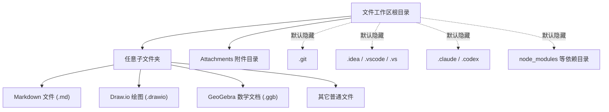

<p align="center"></p>

<h1 align="center">MarkTextPro</h1>

<div align="center">
  <strong>集成 Git 的 Markdown 文件编辑管理器</strong><br>
  面向本地文件夹、外部 Markdown 文件和 Git 仓库的轻量编辑管理工具。<br>
  <sub>支持 Linux、macOS、Windows。</sub>
</div>

<br>

<div align="center">
  <a href="LICENSE">
    
  </a>
  <a href="https://github.com/scott20201225/marktext-pro/releases">
    
  </a>
  <a href="https://github.com/scott20201225/marktext-pro/releases/latest">
    
  </a>
</div>

<div align="center">
  <h3>
    <a href="#产品定位">产品定位</a>
    <span> | </span>
    <a href="#核心能力">核心能力</a>
    <span> | </span>
    <a href="#产品选择">产品选择</a>
    <span> | </span>
    <a href="#文件工作区模型">工作区模型</a>
    <span> | </span>
    <a href="#git-联动">Git 联动</a>
    <span> | </span>
    <a href="#截图与演示">截图与演示</a>
    <span> | </span>
    <a href="#下载安装">下载安装</a>
  </h3>
</div>

## 产品定位

MarkTextPro 是一款集成 Git 的 Markdown 文件编辑管理器。它保留自由文件夹管理方式，适合编辑外部 Markdown、维护项目文档、整理本地资料，也适合把一个普通文件夹直接变成可以提交、同步、回滚的 Git 工作区。

## 产品选择

MarkTextPro 和 MarkNotePro 是两个相互独立、但能力互补的产品。

- MarkTextPro：集成 Git 的 Markdown 文件编辑管理器，强调自由文件夹、外部 Markdown 文件、项目文档和临时编辑。
- MarkNotePro：集成 Git 的本地 Markdown 笔记工具，强调笔记工作区、分区组、分区、笔记和长期知识管理。

相关地址：

- MarkTextPro GitHub：[https://github.com/scott20201225/marktext-pro](https://github.com/scott20201225/marktext-pro)
- MarkTextPro Releases：[https://github.com/scott20201225/marktext-pro/releases/latest](https://github.com/scott20201225/marktext-pro/releases/latest)
- MarkNotePro GitHub：[https://github.com/scott20201225/marknote-pro](https://github.com/scott20201225/marknote-pro)
- MarkNotePro Releases：[https://github.com/scott20201225/marknote-pro/releases/latest](https://github.com/scott20201225/marknote-pro/releases/latest)

两者都集成 Git 工作区，都可以用于版本管理、远程同步和多设备协作；选择时更应该看你需要“自由文件编辑管理器”还是“结构化笔记工具”。

下面是同一个项目在两个产品里的展示差异：MarkNotePro 只会展示符合笔记标准的目录和 Markdown 笔记，收敛为分区组 / 分区 / 笔记视图；MarkTextPro 则展示真实文件系统结构，更适合完整项目目录和外部文件管理。

<table>
  <tr>
    <td align="center">
      
      <br>
      <sub>MarkNotePro：只展示符合笔记标准的目录和 Markdown 笔记</sub>
    </td>
    <td align="center">
      
      <br>
      <sub>MarkTextPro：展示完整真实文件系统结构</sub>
    </td>
  </tr>
</table>

选择建议：

| 使用场景 | 推荐产品 |
| --- | --- |
| 你主要编辑外部 Markdown 文件、项目 README、技术文档或临时文件 | MarkTextPro |
| 你希望在真实文件夹或代码仓库中直接新建与编辑 Draw.io 架构图或 GeoGebra 数学模型 | MarkTextPro |
| 你希望保留真实文件夹结构，不希望被笔记层级约束 | MarkTextPro |
| 你需要一个更自由的本地 Markdown 文件编辑管理器 | MarkTextPro |
| 你希望像管理笔记本一样管理长期笔记、知识库、项目资料 | MarkNotePro |
| 你接受并需要分区组、分区、笔记这种固定笔记层级 | MarkNotePro |
| 你希望侧边栏只呈现笔记体系，减少普通文件夹带来的干扰 | MarkNotePro |

## 核心能力

- **本地文件夹管理**：直接打开文件夹，按真实目录结构管理 Markdown、Draw.io 绘图与 GeoGebra 数学文档。
- **外部文档编辑**：可以打开工作区外的 `.md`、`.drawio`、`.ggb` 文件，适合临时查看、编辑和专业处理。
- **多标签与多类型协同编辑**：支持多个 Markdown、Draw.io 绘图与 GeoGebra 文档同时打开、平滑切换与保活编辑。
- **内置 Draw.io 专业绘图引擎**：本地离线集成完整 Draw.io 编辑器，支持直接创建、编辑、自动保存 `.drawio` 图表文件，自动同步应用语言与亮/暗色主题，支持导出 PNG、JPEG、SVG、PDF、HTML、XML 等格式。
- **内置 GeoGebra 数学与几何套件**：本地离线集成官方 GeoGebra 全功能引擎，支持**绘图计算**、**几何**、**3D 计算器**、**CAS（计算机代数）**、**概率统计**与**科学计算器**六大模式，深度适配应用全部亮/暗主题，支持导出 `.ggb`、`.png`、`.svg`、`.pdf`、`.stl`（3D 打印）及直接打印。
- **Markdown 所见即所得编辑**：支持标题、列表、任务、表格、引用、代码块、数学公式、Mermaid、警告块（Callouts）等常用 Markdown 能力。
- **表格增强**：支持表格批量编辑、复制粘贴、与 Excel 互操作等高频办公能力。
- **工作区附件与自包含资源**：当 Markdown 位于工作区内时，本地图片可复制到工作区附件目录并使用相对路径；GeoGebra 插入的图片等资源自动内嵌封装于 `.ggb` 文件中，跨端移动不丢失。
- **工作区内链跳转与路径复制**：支持在侧边栏一键复制文档相对路径或 Markdown 链接，并在文档间快速链接互通。
- **隐藏开发噪音目录**：工作区树默认隐藏 `.git`、`.idea`、`.vscode`、`.vs`、`.claude`、`.codex`、`node_modules` 等常见工具目录。
- **集成 Git 工作区**：内置 Git 操作界面，支持仓库添加、克隆、变更查看、提交、分支、拉取、推送等操作。
- **文件工作区与 Git 仓库联动**：可以从 Git 仓库切换文件工作区，也可以在工作区根目录重命名后同步更新 Git 仓库路径。

## 内置创作引擎：Draw.io 与 GeoGebra

除了 Markdown 写作，MarkTextPro 还将工程图表与理工科数学建模能力直接纳入同一个自由文件工作区，所有引擎均随客户端本地打包、**100% 离线可用**，无需依赖外部网页或云端账号：

| 创作引擎 | 文件后缀 | 支持模式与核心特性 | 主题与导出支持 |
| --- | --- | --- | --- |
| **Draw.io 绘图引擎** | `.drawio` | 流程图、系统架构图、UML、ER 图、网络拓扑图、思维导图等完整图形库；支持多标签页保活切换、快捷键保存与自动保存状态同步 | 自动跟随应用语言与亮/暗色主题；支持导出 `PNG`、`JPEG`、`SVG`、`PDF`、`HTML`、`XML` |
| **GeoGebra 数学套件** | `.ggb` | <ul><li>**绘图计算（Graphing）**：函数图像、导数积分、滑动条、数值表格与完整几何作图工具集</li><li>**几何（Geometry）**：尺规作图、多边形、圆锥曲线、度量与几何变换</li><li>**3D 计算器（3D Graphing）**：空间曲面、立体几何、空间向量与平面交线</li><li>**CAS 计算机代数**：符号微积分、方程精确求解、因式分解与矩阵运算</li><li>**概率统计（Probability）**：正态/二项/泊松等概率分布可视化与区间概率计算</li><li>**科学计算器（Scientific）**：函数定义、数值表格对照与科学运算</li></ul> | 深度适配全部亮/暗色主题（含画布背景、网格、坐标轴、黑色几何对象与公式反色自适应）；插入的图片自动内嵌封装于 `.ggb` 包内；支持导出 `.ggb`、`.png`、`.svg`、`.pdf`、`.stl`（3D 打印）及直接打印 |

## 文件工作区模型

MarkTextPro 的工作区就是一个真实文件夹。它不会强制分区组、分区、笔记层级，而是尊重本地目录结构；同时支持在任意文件夹下混合管理 Markdown、Draw.io 绘图与 GeoGebra 文档，并过滤掉对日常创作无意义的开发噪音目录，保持侧边栏清爽。


```mermaid
flowchart TD
  Root["文件工作区根目录"] --> Folder["任意子文件夹"]
  Folder --> Markdown["Markdown 文件 (.md)"]
  Folder --> Drawio["Draw.io 绘图 (.drawio)"]
  Folder --> GGB["GeoGebra 数学文档 (.ggb)"]
  Folder --> Other["其它普通文件"]
  Root --> Attach["Attachments 附件目录"]
  Root -. "默认隐藏" .-> Git[".git"]
  Root -. "默认隐藏" .-> IDE[".idea / .vscode / .vs"]
  Root -. "默认隐藏" .-> Agent[".claude / .codex"]
  Root -. "默认隐藏" .-> Deps["node_modules 等依赖目录"]
```

工作区规则：

- 文件夹名称和文件名称按真实文件系统显示。
- 支持直接打开 Markdown、Draw.io（`.drawio`）与 GeoGebra（`.ggb`）进行可视化编辑，其它普通文件作为项目上下文存在。
- 剪切、粘贴、重命名、删除文件或文件夹时，会同步处理已打开标签的路径指向。
- 删除工作区内文件时，相关编辑标签会同步关闭，避免继续编辑已不存在的文件。
- 根目录重命名后，会同步更新受管 Git 仓库路径。

## Git 联动

MarkTextPro 把 Git 作为文件工作区的版本管理能力。你可以在编辑区处理 Markdown 文件，也可以切换到 Git 区完成提交、拉取、推送和历史查看。


```mermaid
flowchart LR
  Editor["编辑区"] -- "点击 Git 按钮" --> Git["Git 区"]
  Git -- "点击编辑按钮" --> Editor
  Git -- "选择仓库" --> Confirm{"确认切换仓库？"}
  Confirm -- "确认，并勾选切换工作区" --> Workspace["将文件工作区切换到当前仓库或子目录"]
  Confirm -- "确认，但不切换工作区" --> GitOnly["仅切换 Git 仓库"]
  Workspace --> Reload["关闭已打开文件并重载工作区"]
  Editor -- "重命名根目录" --> Sync["同步更新受管 Git 仓库路径"]
  Sync --> Git
```

联动关系：

- Git 区可以选择仓库，切换前会确认，避免误点。
- 默认可以勾选“切换工作区”，让文件工作区跟随当前 Git 仓库。
- 也可以取消勾选，只切换 Git 仓库，保留当前文件工作区。
- 从 Git 区可以把当前仓库根目录或仓库子目录设置为文件工作区。
- 如果工作区根目录重命名，MarkTextPro 会同步更新受管 Git 仓库路径，避免 Git 区找不到仓库。
- 允许 Git 仓库和文件工作区不是同一个目录，适合更复杂的本地目录规划。

## 截图与演示

[查看完整功能展示图](docs/assets/screenshots/showcase-overview.png)

<table>
  <tr>
    <td align="center" colspan="2">
      
      <br>
      <sub>在编辑区和 Git 区之间切换，完成仓库操作与工作区联动</sub>
    </td>
  </tr>
  <tr>
    <td align="center">
      
      <br>
      <sub>五种警告块样式</sub>
    </td>
    <td align="center">
      
      <br>
      <sub>段落菜单与警告块</sub>
    </td>
  </tr>
  <tr>
    <td align="center">
      
      <br>
      <sub>任务状态批量编辑</sub>
    </td>
    <td align="center">
      
      <br>
      <sub>列表缩进菜单</sub>
    </td>
  </tr>
  <tr>
    <td align="center" colspan="2">
      
      <br>
      <sub>插入面板</sub>
    </td>
  </tr>
  <tr>
    <td align="center" colspan="2">
      
      <br>
      <sub>表格工具能力</sub>
    </td>
  </tr>
  <tr>
    <td align="center">
      
      <br>
      <sub>表格复制粘贴</sub>
    </td>
    <td align="center">
      
      <br>
      <sub>Excel 与 MarkTextPro 表格互操作</sub>
    </td>
  </tr>
  <tr>
    <td align="center" colspan="2">
      
      <br>
      <sub>集成 Git 工作区：查看变更、历史、分支并提交同步</sub>
    </td>
  </tr>
</table>

## 下载安装


请从 [Release 页面](https://github.com/scott20201225/marktext-pro/releases/latest) 下载对应系统版本：

- macOS：`marktextpro-mac-(arm64|x64)-%version%.dmg`
- Windows：`marktextpro-win-(x64|arm64)-%version%-setup.exe`
- Linux：提供 `deb`、`rpm`、`snap`、`tar.gz` 等构建，具体以 Release 页面为准。

## 开发

```bash
pnpm install
pnpm --filter marktextpro dev
```

构建桌面端：

```bash
pnpm --filter marktextpro build
```

## 许可与商业授权

本项目采用 **[MarkTextPro 非商业使用与商业授权许可协议](LICENSE)**：

- **非商业用途免费**：个人学习、教学演示、学术研究及个人技术/文档管理可免费下载和使用。
- **商业用途需授权（严禁未授权商用）**：未经版权所有人（[ScottCheng](https://github.com/scott20201225)）事先书面授权，严禁将 MarkTextPro（含源代码、二进制安装包、衍生修改版或内嵌模块）用于任何商业目的（包括但不限于直接或间接售卖、打包进商业产品/SaaS服务、企业商业化部署或抹除署名二次分发）。如需商业使用，请联系作者获取书面商业授权。

### 内置核心组件协议声明

MarkTextPro 集成了以下开源与第三方核心组件，各组件遵循其对应上游协议（详见 [LICENSE](LICENSE)）：

- **draw.io (diagrams.net)**：遵循 [Apache License 2.0](https://www.apache.org/licenses/LICENSE-2.0)（`Copyright (c) 2005-present JGraph Ltd`）。
- **GeoGebra**：遵循 [GeoGebra License](https://www.geogebra.org/license)（源码遵循 **GPLv3**，软件、文档与语言资源遵循 **GeoGebra Non-Commercial License Agreement / CC BY-NC-SA 3.0**，仅限非商业用途免费使用，商业用途须同时遵守 GeoGebra 官方商业许可要求）。
- **GitHub Desktop**：遵循 MIT License（`Copyright (c) GitHub, Inc.`）。
- **MarkText & Muya**：遵循 MIT License（`Copyright (c) 2017-present Luo Ran & MarkText Contributors`）。

