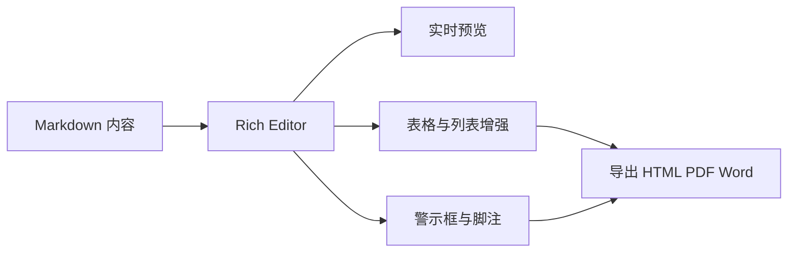
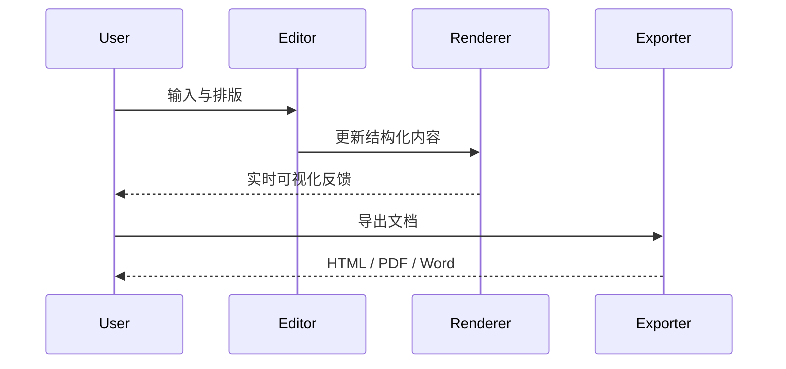
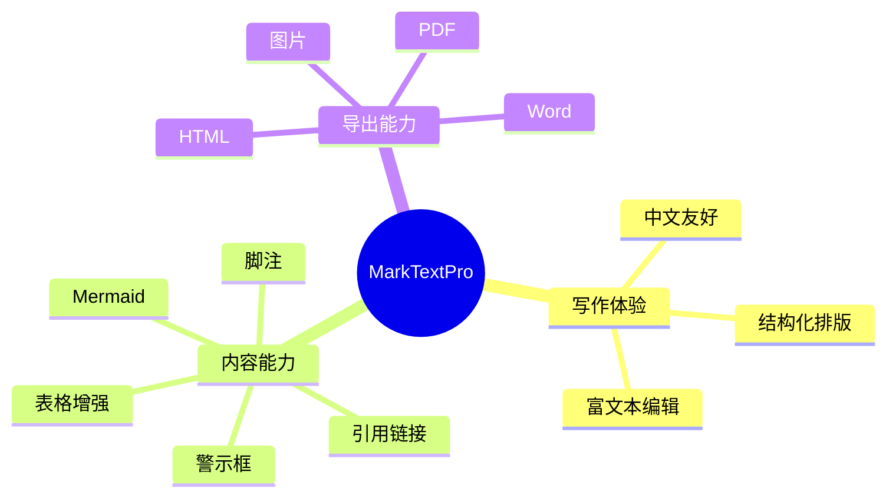

# MarkTextPro Feature Showcase

> 一份适合截图、录屏和 README 展示替换的综合文档。

## 特色能力速览

MarkTextPro 当前最值得优先展示的能力，不是基础 Markdown，而是这些已经明显拉开体验差异的部分：

- 警示框：五种类型、不同图标语义、适合文档说明截图。
- Mermaid：流程图、时序图、脑图三类都能直接展示。
- 表格增强：行列操作、插入删除、整体删除，适合录屏。
- 脚注与引用链接：标签可编辑，结构表达更自然。
- 任务列表：更适合演示右键、状态切换和列表结构能力。

## 警示框

> [!NOTE]
>
> 这是提醒框，适合普通说明、补充备注、轻提示内容。

> [!TIP]
>
> 这是提示框，适合放快捷操作、推荐做法、经验结论。

> [!IMPORTANT]
>
> 这是重要框，适合强调结论、关键约束、必须注意的行为。

> [!WARNING]
>
> 这是警告框，适合展示风险、兼容性问题和操作前提醒。

> [!CAUTION]
>
> 这是注意框，适合提示不可逆行为、删除前确认、发布前检查。

## Mermaid 图表







## 表格增强

| 功能区域 | 当前状态 | 适合截图的点                   | 备注               |
| -------- |:--------:| ------------------------------ | ------------------ |
| 警示框   | 已完成   | 五种类型、不同图标和色彩       | 更适合文档说明     |
| Mermaid  | 已完成   | Flowchart / Sequence / Mindmap | 适合展示可视化能力 |
| 表格     | 已增强   | 行列操作、插入删除、整体删除   | 适合展示编辑器交互 |
| 列表     | 已增强   | 任务列表、缩进、右键能力       | 适合展示效率能力   |
| 脚注     | 已增强   | 标签可编辑、行为更贴近写作体验 | 适合展示细节能力   |
| 引用链接 | 已增强   | 标签与内容分离、定义区清晰     | 适合展示结构能力   |

### 本周迭代示例

| 模块        | 负责人     | 进度 | 输出                        |
| ----------- | ---------- |:----:| --------------------------- |
| 编辑体验    | ScottCheng | 90%  | 列表、脚注、警示框          |
| 图表能力    | ScottCheng | 85%  | Mermaid flowchart / mindmap |
| 导出能力    | ScottCheng | 80%  | HTML / PDF / Word / 图片    |
| README 展示 | ScottCheng | 40%  | 等待正式截图替换            |

## 脚注与引用链接

这里是一段正文示例，适合展示脚注能力[^note]，也适合展示引用链接能力[MarkTextPro 仓库][repo] 与 [Release 页面][release]。

你也可以在同一段里重复引用同一个链接定义，例如再次提到 [MarkTextPro 仓库][repo]，看看整体排版是否稳定。

## 任务与列表

### 任务列表

- [x] 警示框渲染
- [x] Mermaid mindmap
- [x] 引用链接增强
- [x] 脚注编辑增强
- [x] 表格增强操作
- [ ] Windows 机器完整体验巡检
- [ ] README 正式截图替换

### 无序列表

- Markdown 写作
- 文档整理
- 知识归档
  - 结构梳理
    - 标签沉淀
  - 跨文档引用

### 有序列表

1. 收集素材
2. 搭建结构
3. 完成正文
4. 统一格式
5. 导出交付

## 沉浸式写作

MarkTextPro 的目标不是只把 Markdown 写出来，而是把「写作体验、结构表达、可视化能力、导出能力」放在同一个工作流里。

- 默认以中文内容排版，适合日常笔记、文档说明、知识沉淀。
- Rich Editor 下可以直接操作列表、表格、警示框、脚注、引用链接等结构化内容。
- Mermaid、任务列表、表格增强、脚注与引用链接都能作为可展示功能单独截图。

## 引用与代码

> 一个好用的 Markdown 编辑器，不只是「能写」，而是「愿意一直写」。

```ts
type ExportKind = 'html' | 'pdf' | 'word' | 'image'

interface ShowcaseItem {
  title: string
  enabled: boolean
  kind: ExportKind[]
}

const feature: ShowcaseItem = {
  title: 'MarkTextPro',
  enabled: true,
  kind: ['html', 'pdf', 'word', 'image']
}
```

```json
{
  "product": "MarkTextPro",
  "defaultLanguage": "zh-CN",
  "focus": [
    "writing",
    "structure",
    "visualization",
    "export"
  ]
}
```

## 多语言混排

简体中文、繁體中文、English、Deutsch、Français、Italiano、日本語、한국어 可以出现在同一份文档中，用来观察字体、行高、段落节奏和混排观感。

- 简体中文：专注写作与结构表达。
- 繁體中文：適合繁中環境展示。
- English: clean writing and readable structure.
- Deutsch: strukturierte Inhalte und technische Dokumentation.
- Français: notes, documentation et export.
- Italiano: scrittura, organizzazione, produttività.
- 日本語: 文章構造とノート整理。
- 한국어: 문서 작성과 구조화된 편집.

## 截图建议

如果你要给 README 换截图，建议优先截下面几类画面：

1. 顶部标题 + 警示框
2. Mermaid flowchart / mindmap
3. 表格增强区域
4. 脚注与引用链接
5. 任务列表 + 多级列表

[^note]: 脚注适合展示可编辑标签、结构化注释和贴近写作场景的交互。 [repo]: https://github.com/scott20201225/marktext-pro [release]: https://github.com/scott20201225/marktext-pro/releases
